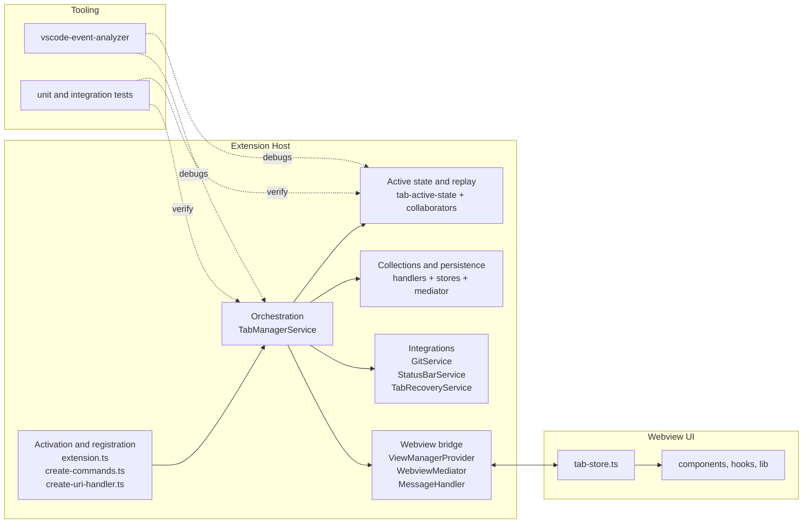
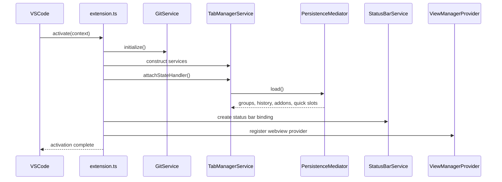
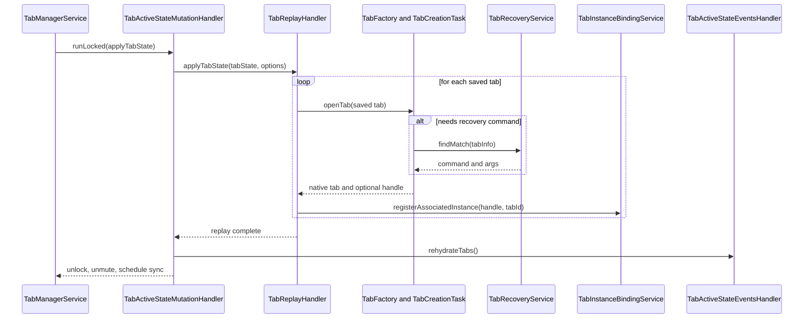
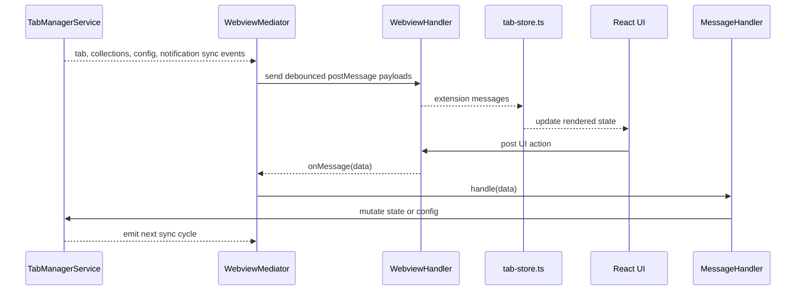
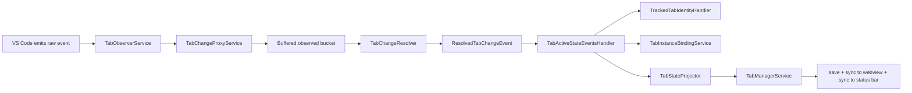
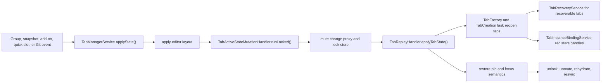

# Architecture Guide

This guide is for AI assistants and contributors who need a fast, current map of Tab Stack before making changes. It follows the repo's Octocode-first workflow: narrow the search surface with structural tools first, then read source files directly to verify behavior.

## Start with Octocode

Use this order when researching the repo:

1. `semantic_search` or `octocode search -m code` to find likely files.
2. `view_signatures` or `octocode view` to inspect file shape before opening full sources.
3. `graphrag` when the question is about relationships across files.
4. Direct file reads only after the candidate set is small.

Useful starting queries:

```bash
octocode search -m code "TabManagerService"
octocode search -m code "TabActiveStateHandler"
octocode search -m code "TabChangeProxyService"
octocode search -m code "TabInstanceBindingService"
octocode search -m code "WebviewMediator"
octocode view src/extension.ts src/services/tab-manager.ts src/handlers/tab-active-state.ts
octocode graphrag overview
```

## What matters most

- `src/extension.ts` is the extension-host entry point and service composition root.
- `src/services/tab-manager.ts` is the orchestration hub for persistence, rendering, syncing, commands, Git integration, and notifications.
- `src/handlers/tab-active-state.ts` is the live tab-state boundary, but it is now a composition root for several collaborators instead of a single monolithic handler.
- `src/services/tab-observer.ts`, `src/services/tab-change-proxy.ts`, `src/handlers/tab-change-batch-coordinator.ts`, `src/handlers/tab-change.ts`, `src/handlers/group-event-synthesizer.ts`, and `src/handlers/tab-event-operation-builder.ts` form the observation, synthesis, and normalization pipeline.
- `src/services/tab-instance-binding.ts` and `src/handlers/tracked-tab-identity.ts` are the authority for runtime tab identity and editor/notebook/terminal association.
- `src/providers/view-manager.ts`, `src/handlers/webview.ts`, `src/mediators/webview.ts`, `src/handlers/message.ts`, and `src/webview/stores/tab-store.ts` form the host-to-webview bridge.
- Keep extension-host code under `src/` separate from React/webview source under `src/webview/`. Root `webview.html`, `webview.css`, `webview.js`, `extension.js`, and `extension.browser.js` are build outputs, not the primary source of truth.

## Runtime surfaces

| Surface | Entry points | Notes |
| --- | --- | --- |
| Extension activation and registration | `src/extension.ts`, `src/create-commands.ts`, `src/create-uri-handler.ts`, `src/create-test-helper.ts` | Builds long-lived services, registers commands and URI routes, exposes test-only hooks, and registers the sidebar view. |
| Orchestration and render queue | `src/services/tab-manager.ts`, `src/services/config.ts`, `src/services/editor-layout.ts` | Owns handler attachment, hydration, queued renders, import/export, collection sync, config sync, and notifications. |
| Observation and normalization pipeline | `src/services/tab-observer.ts`, `src/services/tab-change-proxy.ts`, `src/handlers/tab-change-batch-coordinator.ts`, `src/handlers/tab-change.ts`, `src/handlers/group-event-synthesizer.ts`, `src/handlers/tab-event-operation-builder.ts`, `src/handlers/move-classifier.ts`, `src/state-machines/tab-buffer.ts` | Turns raw VS Code tab and group events into resolved created, closed, moved, and updated deltas. |
| Active state, identity, and replay | `src/handlers/tab-active-state.ts`, `src/handlers/tab-active-state-events.ts`, `src/handlers/tab-active-state-mutation.ts`, `src/handlers/tab-state-projector.ts`, `src/handlers/tab-replay.ts`, `src/handlers/tracked-tab-identity.ts`, `src/services/tab-instance-binding.ts`, `src/handlers/tab-factory.ts`, `src/handlers/tab-creation-task.ts`, `src/state-machines/tab-creation.ts` | Tracks live tab metadata, locks state during replay, preserves runtime identities, and reopens saved tabs. |
| Collections and persistence | `src/handlers/tab-collection-state.ts`, `src/handlers/tab-state-container.ts`, `src/mediators/persistence.ts`, `src/handlers/file-storage.ts`, `src/handlers/workspace-storage.ts`, `src/stores/`, `src/transformers/migration.ts`, `src/transformers/tab-uris.ts` | Owns groups, snapshots, add-ons, quick slots, selected state containers, storage backends, and migration/import-export transforms. |
| Integrations and shell surfaces | `src/services/git.ts`, `src/services/status-bar.ts`, `src/services/tab-recovery-resolver.ts` | Connects the manager to the built-in Git extension, the status bar, and command-based tab recovery mappings. |
| Webview UI and bridge | `src/providers/view-manager.ts`, `src/handlers/webview.ts`, `src/mediators/webview.ts`, `src/handlers/message.ts`, `src/webview/` | Hosts the sidebar, translates sync events into messages, and routes UI actions back to the extension host. |
| Tooling, tests, and builds | `tools/vscode-event-analyzer/`, `tools/octocode/`, `tests/unit/`, `tests/integration/`, `build-node.cjs`, `build-browser.cjs`, `build-webview.cjs` | Provides event diagnostics, AI indexing, unit coverage, Electron integration coverage, and generated build artifacts. |



## Core architecture

### Activation and registration

- `src/extension.ts` initializes the logger, `EditorLayoutService`, `ConfigService`, `TabRecoveryService`, `GitService`, `TabManagerService`, `StatusBarService`, and `ViewManagerProvider`.
- `TabManagerService.attachStateHandler()` is awaited during activation, so persistence hydration and initial state selection happen before the extension finishes bootstrapping.
- `src/create-commands.ts` translates command palette, editor-title, and context-menu actions into `TabManagerService` calls and quick-pick flows.
- `src/create-uri-handler.ts` exposes validated `vscode://ayecue.tab-stack/...` routes that map to the same command surface.
- `src/create-test-helper.ts` registers hidden test-only commands and runtime capture hooks when `VSCODE_TAB_STACK_TEST` is set. Integration tests depend on this path.



### Orchestration hub

- `src/services/tab-manager.ts` is the central coordinator.
- It creates the change proxy, attaches the active-state, collection, and state-container handlers, hydrates persisted data through `PersistenceMediator`, and decides whether the current selection comes from saved groups or the live window.
- It owns the render queue (`applyState()`, `next()`, `render()`), import/export flows, quick slots, snapshots, add-ons, group switching, notifications, and sync emitters for the webview and status bar.
- It reattaches state handlers when master-workspace or storage-type config changes require a different persistence scope.
- When a change affects command behavior, hydration, replay, persistence, Git-driven group switching, or UI sync, inspect this file first.

### Observation, synthesis, and normalization pipeline

- `src/services/tab-observer.ts` captures versioned before/after snapshots around raw `window.tabGroups` tab and group events.
- `src/services/tab-change-proxy.ts` sends those observed events into `src/state-machines/tab-buffer.ts`, an XState machine that buffers for 100 ms and supports `MUTE` and `UNMUTE` during replay.
- `src/handlers/tab-change-batch-coordinator.ts` records a bucket of observed events and compresses duplicate group-change noise and open-then-changed sequences before resolution.
- `src/handlers/tab-change.ts` (`TabChangeResolver`) owns session-based resolution for a bucket. It seeds `TabChangeSession`, routes tab events through `TabEventOperationBuilder`, and classifies final changes into created, closed, moved, and updated deltas.
- `src/handlers/group-event-synthesizer.ts` is the synthetic event layer for group changes. Its five stages are: closed groups, opened groups, cascading view-column shifts, changed groups, and move classification.
- `src/handlers/tab-event-operation-builder.ts` converts raw tab events plus snapshots into normalized add, remove, and update operations.
- `src/handlers/move-classifier.ts` pairs remove/add chains into move semantics so downstream consumers work with stable identities instead of raw close/open noise.
- If the issue depends on event ordering, duplication, or missing VS Code signals, start here and run `npm run analyze:events` before changing replay logic.

```mermaid
flowchart LR
  Raw["window.tabGroups<br/>tab and group events"] --> Observer["TabObserverService<br/>capture before and after snapshots"]
  Observer --> Proxy["TabChangeProxyService"]
  Proxy --> Buffer["tabBufferMachine<br/>100 ms bucket<br/>supports MUTE and UNMUTE"]
  Buffer --> Batch["TabChangeBatchCoordinator<br/>record and compress observed bucket"]
  Batch --> Resolver["TabChangeResolver"]

  subgraph Resolve["Resolver internals"]
    direction TB
    Resolver --> GroupSynth["GroupEventSynthesizer<br/>closed, opened, cascading VC shifts,<br/>changed groups, classify moves"]
    Resolver --> OpBuilder["TabEventOperationBuilder<br/>tab events to add, remove, update ops"]
    GroupSynth --> Session["TabChangeSession"]
    OpBuilder --> Session
    Session --> Classifier["MoveClassifier"]
    Classifier --> Resolved["ResolvedTabChangeEvent"]
  end

  Resolved --> Events["TabActiveStateEventsHandler"]
  Events --> Identity["TrackedTabIdentityHandler"]
  Events --> Binding["TabInstanceBindingService"]
  Events --> Projector["TabStateProjector"]
  Projector --> ManagerSync["TabManagerService"]
  ManagerSync --> Outputs["Persistence, webview sync,<br/>status bar sync"]
```



### Active state, identity, mutation, and replay

- `src/handlers/tab-active-state.ts` is now a composition root for the live-state stack, not a single all-in-one handler.
- `src/handlers/tab-active-state-events.ts` subscribes to resolved proxy events plus active editor, notebook, terminal, selection, shell-execution, and layout changes. It invalidates projections and schedules state sync.
- `src/handlers/tracked-tab-identity.ts` keeps `tab key -> TabInfoId` mappings stable across moves, updates, closures, and rehydration.
- `src/services/tab-instance-binding.ts` is the canonical association registry for `TextEditor`, `NotebookEditor`, and `Terminal` instances. It is responsible for binding runtime instances back to `TabInfoId` and updating tracked selection or terminal metadata.
- `src/handlers/tab-state-projector.ts` derives `TabState` and `TabManagerState` from the live VS Code window plus tracked metadata from the active-state store.
- `src/handlers/tab-active-state-mutation.ts` locks the store, mutes the change proxy during replay, then rehydrates runtime associations and schedules a fresh state update when unlock completes.
- `src/handlers/tab-replay.ts` applies saved tab states, preserves pin and focus behavior, moves editor groups through layout helpers, and registers reopened instances back into the identity maps.
- `src/handlers/tab-factory.ts`, `src/handlers/tab-creation-task.ts`, `src/operations/tab-creation.ts`, and `src/state-machines/tab-creation.ts` implement the reopen path for saved tabs and the async discovery of related tabs and editor handles.
- `src/services/tab-recovery-resolver.ts` matches configured recovery mappings for tabs that cannot be reopened directly through the standard factory path.



### Stores, collections, and persistence

- State in the extension host is store-backed.
- `src/stores/tab-active-state.ts` tracks the live tab registry and lock state.
- `src/stores/tab-state-container.ts` tracks the current and previous `StateContainer`, including forked unsaved state.
- `src/stores/tab-collection-state.ts` tracks groups, history entries, add-ons, and quick-slot assignments.
- `src/stores/persistence.ts` tracks loaded file content and emits writes through the active persistence handler.
- `src/handlers/tab-collection-state.ts` wraps the collection store and owns group/history/add-on lifecycle plus quick-slot updates.
- `src/handlers/tab-state-container.ts` wraps the state-container store and owns current-state selection, previous-state tracking, and live-state synchronization.
- `src/mediators/persistence.ts` selects the active storage backend from `ConfigService`.
- `src/handlers/file-storage.ts` persists `.vscode/tmstate.json` in the selected master workspace folder.
- `src/handlers/workspace-storage.ts` persists into VS Code workspace state.
- `src/transformers/migration.ts` upgrades persisted files during load, while `src/transformers/tab-uris.ts` resolves relative and absolute URI conversions during persistence and import/export.

### Config, Git, status bar, and workspace scope

- `src/services/config.ts` owns storage, master workspace selection, Git integration, history limits, tab recovery mappings, status bar visibility, and tab-kind color configuration.
- `src/services/git.ts` attaches to the built-in `vscode.git` extension, scopes itself to the configured master workspace folder, and emits repository-open and branch-change events.
- `TabManagerService` listens to those Git events and applies the configured integration mode (`auto-switch`, `auto-create`, or `full-auto`) to saved groups.
- `src/services/status-bar.ts` subscribes to render and collection sync events and projects the currently selected group plus quick-slot information into a single status bar item.
- Workspace-folder selection changes are architectural, not cosmetic: they can cause persistence reloads, Git reattachment, and handler rehydration.

### Webview bridge

- `src/providers/view-manager.ts` creates a `WebviewHandler`, `MessageHandler`, and `WebviewMediator` every time the sidebar view resolves.
- `src/handlers/webview.ts` owns the HTML shell, CSP nonce injection, resource URI rewrites, and debounced outbound sync messages.
- `src/mediators/webview.ts` wires `TabManagerService` sync and notification events into the webview and routes inbound webview messages back through `MessageHandler`.
- `src/handlers/message.ts` dispatches UI actions to `TabManagerService` or `ConfigService`, including tab operations, group lifecycle, snapshots, add-ons, quick slots, import/export, workspace selection, and settings updates.
- The React webview source lives under `src/webview/`. The root `webview.html`, `webview.css`, and `webview.js` files are generated shell assets used by the host.
- `src/webview/stores/tab-store.ts` is the client-side mirror of tab state, collections, config, connection status, and transient error state.



### Types, transformers, and utilities

- `src/types/tabs.ts` defines `TabInfo`, `TabKind`, editor and terminal metadata, and `TabState`.
- `src/types/tab-manager.ts` defines `TabManagerState`, `StateContainer`, `TabStateFileContent`, and the `ITabManagerService` contract.
- `src/types/messages.ts` defines the host-to-webview and webview-to-host contract.
- `src/transformers/` handles migration, URI normalization, and tab projection helpers.
- `src/utils/layout.ts`, `src/utils/commands.ts`, `src/utils/tab-utils.ts`, `src/utils/tracked-tab-equality.ts`, and related helpers are the canonical low-level building blocks. Reuse them instead of recreating matching, layout, or command logic elsewhere.

## Key state model

- `src/types/tabs.ts`
  - `TabInfo`: persisted representation of a single tab, including kind-specific metadata and recoverability.
  - `TabState`: grouped tab layout keyed by `viewColumn` plus the active group.
  - `AssociatedTabInstance`: runtime instance type for `TextEditor`, `NotebookEditor`, or `Terminal` bindings.
- `src/types/tab-manager.ts`
  - `TabManagerState`: `TabState` plus layout data.
  - `StateContainer`: named saved state used for groups, snapshots, and add-ons.
  - `TabStateFileContent`: top-level persisted format for collections, selected and previous groups, quick slots, and schema version.
- Runtime identity maps matter:
  - `associatedTabs`: maps live tab keys to `TabInfoId`.
  - `associatedInstances`: maps `TextEditor`, `NotebookEditor`, or `Terminal` instances back to `TabInfoId`.

## Primary flows

### Activation and hydration

1. `src/extension.ts` constructs the shared services and initializes Git when available.
2. `TabManagerService.attachStateHandler()` creates the active-state, state-container, and collection handlers plus a fresh `PersistenceMediator`.
3. Persistence loads saved file content, migrations are applied as needed, and the collection handler hydrates groups, snapshots, add-ons, and quick slots.
4. The current and previous state containers are restored from saved groups. If there is no valid saved selection, the active-state handler rehydrates from the live window and seeds an unsaved container.
5. `TabManagerService.applyState(null)` starts the initial render/sync cycle, then the webview and status bar receive their first synced state.

### Raw events to synchronized state

1. VS Code emits tab or group changes.
2. `TabObserverService` captures before/after versioned snapshots.
3. `TabChangeProxyService` forwards those observed events into `tabBufferMachine`.
4. After the buffer delay, `TabChangeBatchCoordinator` compresses the bucket and `TabChangeResolver` resolves it through synthetic group-event expansion, operation building, and move classification.
5. `TabActiveStateEventsHandler` applies the resolved changes via `TrackedTabIdentityHandler`, refreshes runtime associations, invalidates projections, and schedules a fresh state update.
6. `TabActiveStateHandler` emits the projected `TabManagerState`, `TabStateContainerHandler` syncs the current container, and `TabManagerService` persists and rebroadcasts the result.



### Restore and replay

1. A group, snapshot, add-on, quick slot, or Git event selects a target state.
2. `TabManagerService.applyState()` enqueues a render and applies the target editor layout.
3. `TabActiveStateMutationHandler` locks the active-state store and mutes the change proxy.
4. `TabReplayHandler` reopens tabs through `TabFactory` and `TabCreationTask`; `TabRecoveryService` recreates non-standard tabs through configured commands when necessary.
5. Replay reapplies pin and focus semantics, records reopened runtime instances, and merges tab identities back into the tracked registry.
6. Unlocking rehydrates live associations, unmutes observation, and schedules a fresh projected sync from the real window state.



### Webview roundtrip

1. `ViewManagerProvider` resolves the sidebar and initializes the mediator.
2. `WebviewMediator` forwards `tab-state-sync`, `collections-sync`, `config-sync`, and notification events from `TabManagerService`.
3. `src/webview/stores/tab-store.ts` updates the client-side state used by the React UI.
4. UI actions post messages back through `src/webview/lib/` messaging helpers.
5. `MessageHandler` delegates those mutations to `TabManagerService` or `ConfigService`, which triggers the next sync cycle.

### Git-driven group switching

1. `GitService` detects repository-open and branch-change events for the configured master workspace folder.
2. `TabManagerService` derives the target group name from the configured Git prefix and integration mode.
3. The manager switches to an existing group, creates a new one, or does nothing based on config.
4. The resulting state change follows the normal render, persistence, and sync path.

## Fast change map

| Task | Start here | Then inspect |
| --- | --- | --- |
| Add or change a command | `src/create-commands.ts` | `src/services/tab-manager.ts`, `src/types/tab-manager.ts`, `package.json` |
| Add or change a URI route | `src/create-uri-handler.ts` | `src/create-commands.ts`, `src/services/tab-manager.ts`, `README.md` |
| Debug tab or group events | `tools/vscode-event-analyzer/`, `src/services/tab-observer.ts` | `src/services/tab-change-proxy.ts`, `src/handlers/tab-change-batch-coordinator.ts`, `src/handlers/tab-change.ts`, `src/handlers/group-event-synthesizer.ts`, `src/handlers/tab-event-operation-builder.ts`, `src/state-machines/tab-buffer.ts` |
| Change replay or restore behavior | `src/services/tab-manager.ts`, `src/handlers/tab-active-state.ts` | `src/handlers/tab-replay.ts`, `src/handlers/tab-factory.ts`, `src/handlers/tab-creation-task.ts`, `src/state-machines/tab-creation.ts`, `src/services/tab-recovery-resolver.ts` |
| Change cursor, notebook, or terminal metadata capture | `src/services/tab-instance-binding.ts` | `src/handlers/tab-active-state-events.ts`, `src/handlers/tab-state-projector.ts`, `src/types/tabs.ts` |
| Change identity or tab remapping behavior | `src/handlers/tracked-tab-identity.ts` | `src/handlers/tab-change.ts`, `src/services/tab-instance-binding.ts`, `src/utils/tab-utils.ts` |
| Change groups, history, add-ons, or quick slots | `src/handlers/tab-collection-state.ts`, `src/handlers/tab-state-container.ts` | `src/stores/tab-collection-state.ts`, `src/stores/tab-state-container.ts`, `src/services/tab-manager.ts` |
| Change save/load behavior | `src/mediators/persistence.ts` | `src/handlers/file-storage.ts`, `src/handlers/workspace-storage.ts`, `src/stores/persistence.ts`, `src/transformers/migration.ts`, `src/transformers/tab-uris.ts` |
| Add a webview action | `src/types/messages.ts` | `src/handlers/message.ts`, `src/mediators/webview.ts`, `src/webview/lib/tab-messaging-service.ts`, `src/webview/stores/tab-store.ts` |
| Change the sidebar UI | `src/webview/index.tsx`, `src/webview/components/`, `src/webview/hooks/` | `src/webview/stores/tab-store.ts`, `src/handlers/message.ts`, `src/types/messages.ts` |
| Change Git or status-bar behavior | `src/services/git.ts`, `src/services/status-bar.ts` | `src/services/tab-manager.ts`, `src/services/config.ts`, `package.json` |
| Add tests for behavior | matching files under `tests/unit/` or `tests/integration/` | `tests/factories/`, `tests/mocks/`, `tests/integration/suite/helpers/`, `src/create-test-helper.ts` |

## Guardrails

- Keep observation, buffering, synthetic event generation, resolution, projection, replay, and persistence as separate concerns.
- Treat `TabInstanceBindingService` and `TrackedTabIdentityHandler` as the authoritative runtime identity layer. Do not recreate matching logic in unrelated helpers.
- Route user-visible state changes through `TabManagerService` so persistence and sync stay coherent.
- During replay, always go through the mutation-lock and proxy-mute path instead of ad-hoc event suppression.
- Prefer store and handler boundaries over direct mutation of shared state objects.
- Edit `src/webview/` for UI source changes unless you intentionally need to change generated root webview assets.
- If you change observable behavior, add or update tests.
- Use `npm run analyze:events` when the problem depends on actual VS Code event ordering.

## Suggested first-read files

- `README.md`
- `AI_SETUP.md`
- `src/extension.ts`
- `src/services/tab-manager.ts`
- `src/handlers/tab-active-state.ts`
- `src/services/tab-change-proxy.ts`
- `src/handlers/tab-change.ts`
- `src/handlers/group-event-synthesizer.ts`
- `src/services/tab-instance-binding.ts`
- `src/mediators/persistence.ts`
- `src/providers/view-manager.ts`
- `src/handlers/message.ts`
- `src/types/messages.ts`